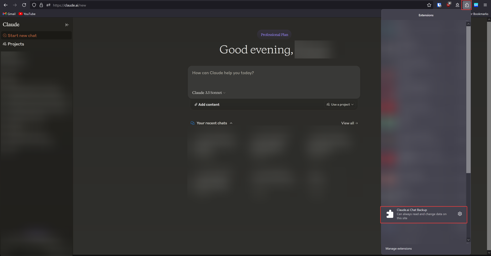
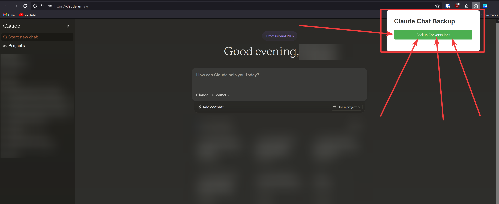
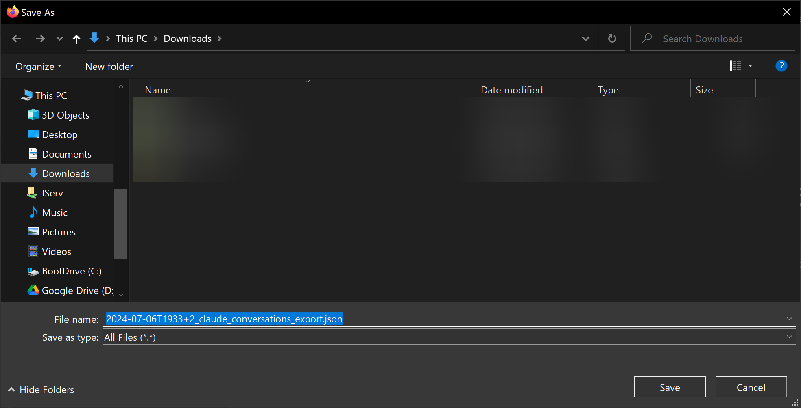
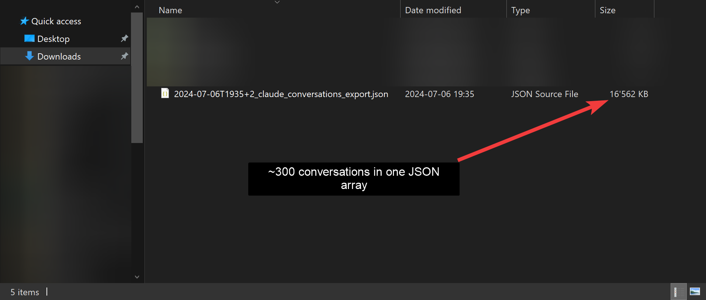

# Claude.ai Chat Backup - Firefox

## Description
**Claude.ai Chat Backup - Firefox** is a Firefox extension that allows users to easily backup all their conversations from Claude.ai into a single JSON file. This tool is perfect if you want to process the files downstream with another tool.

## Features
- One-click backup of all Claude.ai conversations which for example takes ~5 seconds for ~300 conversations
- Exports conversations to a single JSON file
- Filename includes timestamp and timezone offset for easy organization
- Very simple interface

## Installation
1. Download the extension from the Firefox Addon store (link to be added when published)
2. Click on "Add to Firefox" to install the extension

## Usage
1. Click on the "Claude.ai Chat Backup" extension in your Firefox extension menu

2. In the popup, click the "Backup Conversations" button

3. Give it a few seconds to make the requests (If it takes more than 10 seconds you probably broke it, nice job! Sounds like a you problem though...)

4. Choose where you want to save the JSON file

5. Your conversations will be downloaded as a JSON file named in the format: `YYYY-MM-DDTHHMM±Z_claude_conversations_export.json`

## Technical Details
- Built using WebExtensions API
- Written in TypeScript
- Uses `manifest_version` 2
- Requires permissions for cookies, downloads, and access to https://claude.ai/*
  - `cookies`: To know the id of your organization for the API requests
  - `downloads`: To download the JSON file to your device
  - `https://claude.ai/*`: To access the Claude.ai website and make API requests

## Files
- `manifest.json`: Extension configuration
- `chat_export_popup.html`: HTML for the popup UI
- `chat_export_popup.ts`: TypeScript for popup functionality
- `chat_export_background.ts`: Background script for handling API requests and file downloads

## FAQ

### Who can access my data?
Your conversations stay between you, your device and Anthropic. Maybe some [insert intelligence agency] agent too, but they don't count.

### Are you planning to add more features?
Nope. This extension does one thing, and it does it well.

### Will you be updating this regularly?
Unless it breaks, probably not. It works, so why mess with it?

### Can you add support for [insert any feature]?
See previous answers. The extension backs up conversations. That's it.

### I found a bug. Will you fix it?
If it's stopping the extension from doing its one job, maybe. Otherwise, see above.

### Can I contribute to this project?
You're welcome to fork it and go wild. Or shamelessly copy-paste it, I don't care. I won't do any PR reviews though, so I guess no.

### Will you port this to Chrome/Safari/Opera/etc.?
That sounds like work. So, no.

### How often should I back up my conversations?
Whenever you feel like it.

### Is there a premium version with more features?
There isn't even a basic version with more features.

### Where can I get support?
You're looking at all the support you're going to get. This FAQ is it.

### Are you okay?
No, I hate front-end development. Claude did >90% of the work and I still hated it.

## Disclaimer
This extension is not officially associated with Anthropic or Claude.ai. Use at your own risk.
